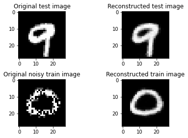

## unsupervised-dl 

* Python scripts/examples for unsupervised ML/DL concepts
* Auto encoders
* Convolutional auto encoders
* PCA
* tSNE

---

*Sample output from denoising auto encoders wtih MNIST*

